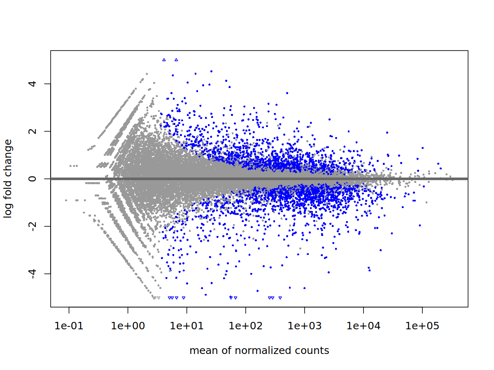
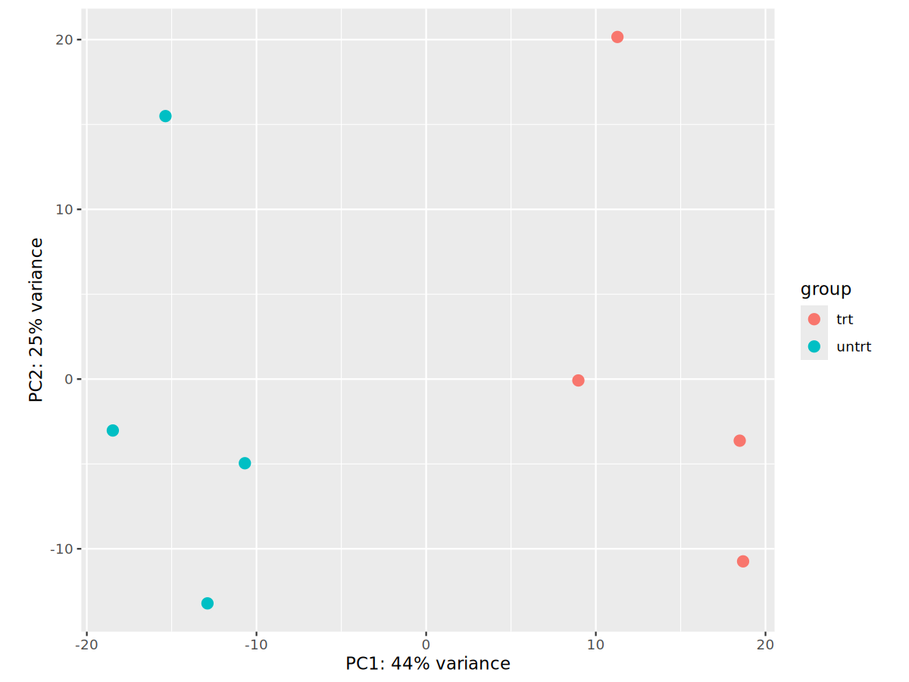
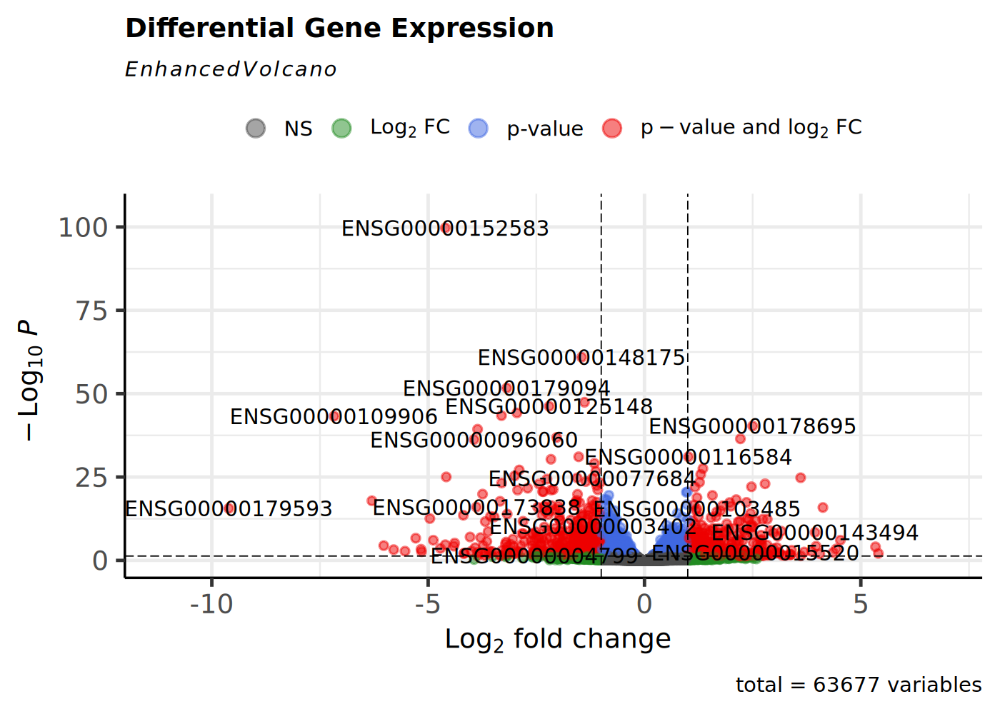
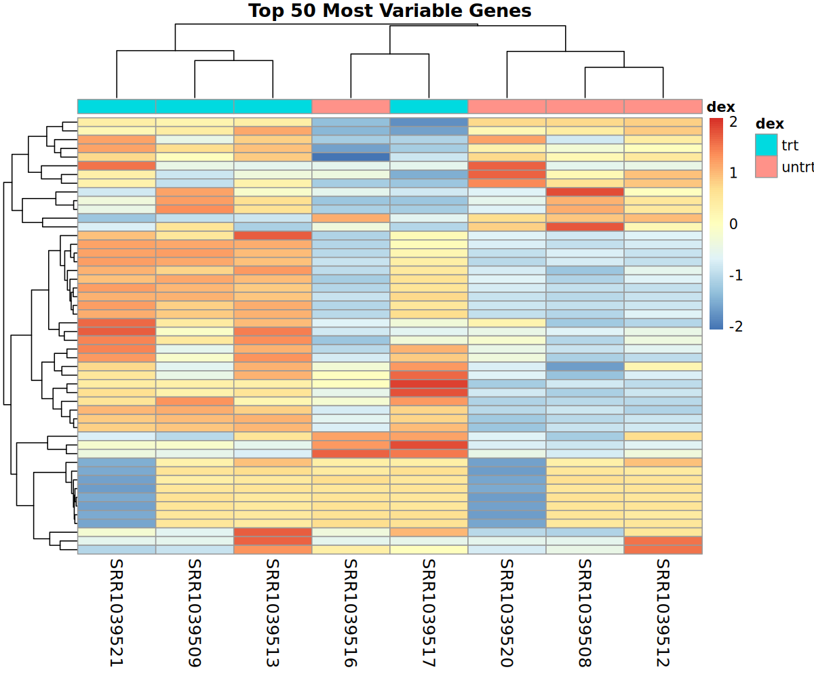

# 🧬 RNA-seq Differential Gene Expression Analysis using DESeq2

**Author:** Kirtikaa Chezhian

**Field:** Bioinformatics | Computational Biology | RNA-seq Analysis

# 📌 Project Overview

This project demonstrates a complete end-to-end RNA-seq differential gene expression (DGE) analysis workflow using Linux, R, and Bioconductor. The objective was to identify genes that are significantly differentially expressed between untreated and dexamethasone-treated human airway smooth muscle cells using the DESeq2 package.

The workflow includes quality control, read trimming, genome alignment, gene quantification, statistical analysis, and biological data visualization.

# 📂 Dataset

This project uses the **airway** RNA-seq dataset available through the Bioconductor package.

### Dataset Information

- **Dataset:** airway
- **Source:** Bioconductor
- **Organism:** *Homo sapiens*
- **Samples:** 8 RNA-seq samples
- **Experimental Design:**
  - 4 Untreated (Control)
  - 4 Dexamethasone-treated (Treatment)
- **Total Genes:** 63,677

The dataset measures gene expression changes in human airway smooth muscle cells after treatment with dexamethasone, a synthetic glucocorticoid commonly used to reduce inflammation.

# 🛠 Software & Tools

## Linux Tools

- Ubuntu (WSL)
- FastQC
- Trimmomatic
- HISAT2
- SAMtools
- featureCounts

## R Packages

- DESeq2
- airway
- EnhancedVolcano
- ggplot2
- pheatmap
- Bioconductor

# 🔬 RNA-seq Workflow

Raw FASTQ Files
        │
        ▼
Quality Control (FastQC)
        │
        ▼
Read Trimming (Trimmomatic)
        │
        ▼
Genome Alignment (HISAT2)
        │
        ▼
SAM → BAM Conversion (SAMtools)
        │
        ▼
Sorting & Indexing BAM
        │
        ▼
Gene Quantification (featureCounts)
        │
        ▼
Differential Expression Analysis (DESeq2)
        │
        ▼
Visualization & Interpretation

# 📊 Alignment Results

| Metric | Result |
|---------|---------|
| Total Read Pairs | 4,699,993 |
| Overall Alignment Rate | **95.11%** |
| Properly Paired Reads | **91.72%** |
| Mapped Reads | **95.86%** |

A high alignment rate (>95%) indicates excellent read quality and a successful mapping of sequencing reads to the reference human genome.

# 📈 Gene Quantification Results

Gene expression was quantified using **featureCounts**.

| Category | Count |
|----------|-------|
| Assigned Reads | **5,469,432** |
| Multi-mapping Reads | 2,540,962 |
| No Feature | 2,138,925 |
| Ambiguous Reads | 484,747 |

# 📊 Differential Expression Analysis

Differential gene expression analysis was performed using the **DESeq2** package.

### Results Summary

- Total genes analyzed: **63,677**
- Significant genes (Adjusted p-value < 0.05): **2,700**
- Statistical method: Wald Test
- Multiple testing correction: Benjamini-Hochberg (FDR)

# 📷 Visualizations

## MA Plot

### Interpretation

The MA plot compares normalized gene expression with log₂ fold change.

- Most genes remain close to zero, indicating no significant change.
- Genes highlighted in blue are significantly differentially expressed.
- Highly expressed genes show stable fold changes.

## PCA Plot

### Interpretation

Principal Component Analysis (PCA) reduces high-dimensional gene expression data into principal components.

The PCA plot shows:

- Clear separation between untreated and dexamethasone-treated samples.
- Replicates cluster closely together.
- Treatment is the major source of biological variation.

This indicates good experimental consistency and a strong treatment effect.

## Volcano Plot

### Interpretation

The volcano plot visualizes statistical significance against fold change.

- Genes on the right are upregulated.
- Genes on the left are downregulated.
- Genes at the top have very small adjusted p-values.
- Red points represent genes with both significant fold change and statistical significance.

This plot highlights the most biologically relevant genes.

## Heatmap

### Interpretation

The heatmap displays the top 50 most variable genes.

- Samples cluster according to treatment condition.
- Similar expression profiles group together.
- Distinct expression patterns are observed between treated and untreated samples.

The clustering confirms that dexamethasone treatment produces consistent transcriptomic changes.

# 📁 Project Structure

RNAseq_DESeq2_Project/
│
├── alignment/
├── counts/
├── fastqc/
├── figures/
├── metadata/
├── raw_data/
├── reference/
├── reports/
├── results/
├── scripts/
├── trimmed/
├── README.md
└── .gitignore

# 📂 Output Files

## Figures

- MA Plot
- PCA Plot
- Volcano Plot
- Heatmap

## Results

- deseq2_results.csv
- significant_genes.csv

# 💻 Skills Demonstrated

- RNA-seq Analysis
- Differential Gene Expression Analysis
- Linux Command Line
- Bash Scripting
- R Programming
- DESeq2
- Data Visualization
- FastQC
- HISAT2
- SAMtools
- featureCounts
- Git
- GitHub
- Bioinformatics Workflow Development

